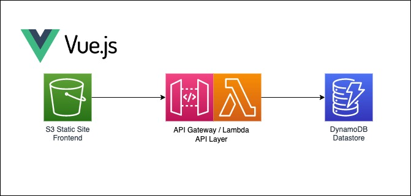

# Jonathan Wilson's Solution

Greetings Balance Homes Team!

In this repo you will find my Todo App.

My Todo App is live and on the internet at https://wilsonwjonathan.com

It is a AWS Servless Backend API composed of API Gateway, Lambda, and DynamoDB.  The frontend is a Vue.js app running on a S3 bucket configured as a static website, behind a Cloudfront distribution.

## Description
This repo is split into 3 directories:
- `terraform`
- `site`
- `.github`

## Terraform
In the `terraform` directory you will find all of the AWS resources defined as Infrastructue as Code.  There is a `modules` directory containing the following modules:
- `api`: TF code for API Gateway, Lambda, and DynamoDB.  In this module there is a `lambdas` folder that has the Python code that runs the CRUD API.
- `static_site`: TF code for S3 and Cloudfront distribution

At the root of the `terraform` directory you will find:
- TF setup files and main module to deploy `api` and `static_site` modules

## Site
In the `site` directory you will find the HTML/CSS/JS files that comprise the Vue.js static site frontend.

## .github
(Note: During development I used a personal Github repo with Github Actions enabled in order to automate deployments: https://github.com/jonwils24/todo-app)

In the `.github` directory you will find the following directories:
- `actions`: Github Actions to Plan/Deploy Terraform and to Sync the Static Site code to S3
- `workflows`: Job and Trigger definitions for when to run the Github Actions.  Closed PRs that merge to the `main` branch trigger a `terraform plan`.  Published releases trigger a `terraform apply` and `aws s3 sync`.

### I look forward to further discussing my solution!